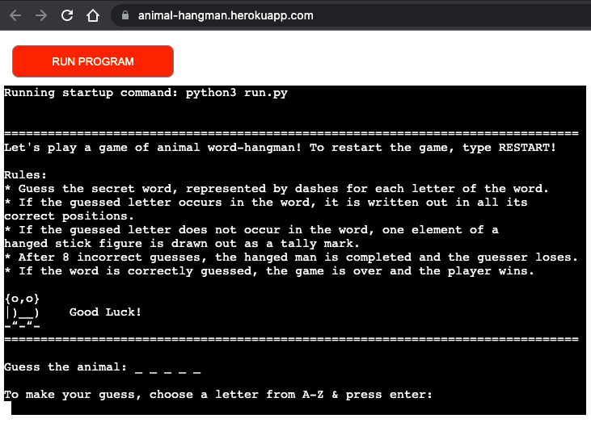
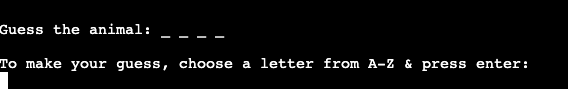
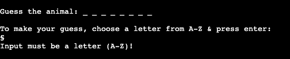
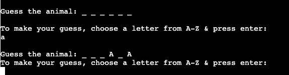
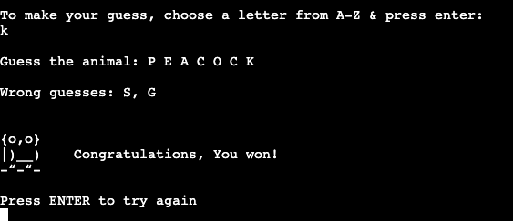
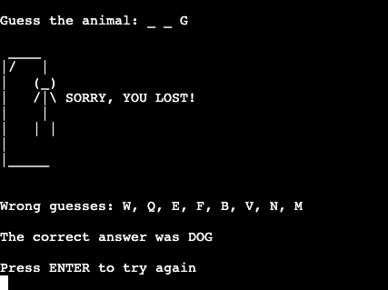
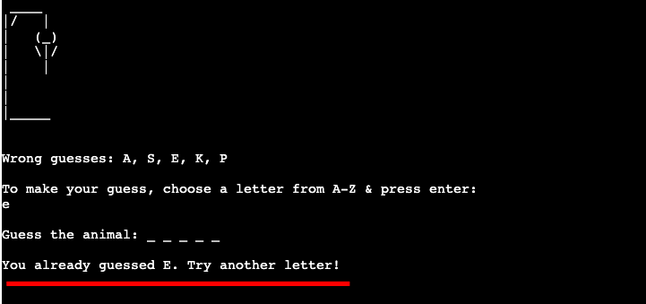
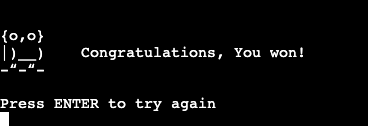

# Animal word hangman 

As a Python project, I decided to make a hangman game. I myself liked to play that game as a child and thought that it would be fun to make using Python. 

## Table of contents

* [General Info](https://github.com/jossansik/portfolio-project3-hangman-game#General-Info)
* [Technology](https://github.com/jossansik/portfolio-project3-hangman-game#Technology)
* [Setup](https://github.com/jossansik/portfolio-project3-hangman-game#Setup)
* [Wireframes](https://github.com/jossansik/portfolio-project3-hangman-game#Wireframes)
* [Flowchart](https://github.com/jossansik/portfolio-project3-hangman-game#Flowchart)
* [Features](https://github.com/jossansik/portfolio-project3-hangman-game#Features)
* [Site owners goals](https://github.com/jossansik/portfolio-project3-hangman-game#Site-owners-goals)
* [User goals](https://github.com/jossansik/portfolio-project3-hangman-game#User-goals)
* [User experience](https://github.com/jossansik/portfolio-project3-hangman-game#User-experience)
* [Testing](https://github.com/jossansik/portfolio-project3-hangman-game#Testing)
* [Bugs](https://github.com/jossansik/portfolio-project3-hangman-game#Bugs)
* [Validator testing](https://github.com/jossansik/portfolio-project3-hangman-game#Validator-testing)
* [Accessibility](https://github.com/jossansik/portfolio-project3-hangman-game#Accessibility)
* [Deployment](https://github.com/jossansik/portfolio-project3-hangman-game#Deployment)
* [Credits](https://github.com/jossansik/portfolio-project3-hangman-game#Credits)

## General Info

This project is a hangman game that runs in the terminal. 

## Technology

Project is created with Python 3.8.2, using the Code Institute Python essentials template on GitHub.

## Setup
The project is deployed through Heroku and accessed at  https://animal-hangman.herokuapp.com/.

## Wireframes

Attached below is a picture of my wireframe or program blueprint, a visual guide that represents the skeletal framework of how I planned out the project.

## Flowchart

Attached below is a Flowchart for the hangman game project, describing the separate steps of the game process in sequential order.

## Features

A console application that runs in a mock terminal on the web. 

The graphical interface is built by using ASCII-characters.

## Site owners goals

The application provides a working hangman game to play against the computer. 

The application handles invalid input data. 

The application has a clear logic and is easy to use and understand for a good user experience.

## User goals

The user wants to keep busy by playing a leisure game on the computer.

The user wants to test their logical ability by figuring out the missing letters.

The user wants to test their vocabulary regarding animal species (since it is a game with only animal words).

## User experience

When the program is started the terminal displays a description of what the application does and the rules of the game. Underneath this there are instructions for the user on how to start playing. 

The user starts the game by inputting a letter and pressing enter, only the keys A-Z are valid inputs.

If the inputted key is invalid, an error message is printed.

If the inputted key is valid, but not corresponding with any letter in the secret word, one element of the hangman chart is printed.

If the inputted key is valid and found in the secret word, it is printed out in all the correct positions.

If the user manages to correctly guess the word before the hanged man is completed, a message of victory is printed.

If the user does not figure out the correct answer and makes 8 incorrect guesses, the hanged man and a message of defeat is printed, as well as the correct answer.

## Testing

The application was tested on Google Chrome and Safari browsers.

For input validations, the following cases were tested:

1. When the player inputs a letter that is not in the word, the letter is added to a list of wrong guesses and written out in the console, so that the player can keep track of which letters they have already guessed.

2. To ensure that the player only can input one letter at a time. A message is shown that input must be a letter from a-z.

3. To ensure that the player only can input letters from a-z, the same message as above is shown.

4. If the player inputs a letter that is already guessed, a message is shown requesting the player to guess another letter, whether the letter is in the word or not. The hangman chart is not printed out.

If the player wants to restart the game, "restart" can be inputted. This resets the cosole and the rules are printed out again.

when the game is over and the player has either lost or won, a message is displayed requesting the player to press enter to try again.

## Bugs

[This](https://github.com/jossansik/portfolio-project3-hangman-game/commit/646d8135d4404bff28bc00e7324164b9438d9a1f) was a bug where the user could input other chars then a-z, resolved using regular expression.

[This](https://github.com/jossansik/portfolio-project3-hangman-game/commit/80820d7996a8c05c33a3b1dd6ba205a071052425) was a bug where the user could run forever, resolved so that the game ends after x number of incorrect attempts.

## Validator testing

Basic manual testing procedures for code validation were implemented on the project by using the pep8onlinecom linter. The testing was used to validate every one of the project files to ensure there were no syntax errors.

## Accessibility

The project is only accessible on web browsers using a computer (not devices using touchscreen) due to the capacity of the mock console.

## Deployment

Using a GitHub integration with Heroku to deploy the python console application to the web. With a template from Code Institute it is possible to run the console application in the browser via node.

The steps for deploying were:

1. Created an account on Heroku.com (from the Heroku dashboard clicked the “Create new app” button).
2. Named the app ”animal-hangman”
3. Selected region (Europe), then clicked “Create app”. 
4. Chose settings. 
5. Added buildpacks to the application (Python, Node js).  
6. Heroku built the app using the code in my Github repository.

## Credits

Flowchart was made using [Miro](https://miro.com/)

Hangman animal words found [here](https://gist.github.com/chrishorton/8510732aa9a80a03c829b09f12e20d9c)

Hangman ASCII-art found [here](http://www.fssnip.net/mO/title/Hangman)

Owl ASCII-art found [here](http://web-owls.com/2006/07/07/ascii-owls/)